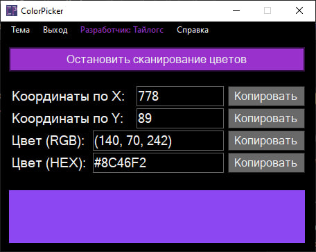

# ColorPicker

ColorPicker — программа, позволяющая получить цвет пикселя, расположенного под дисплеем.

Уже умеет:
- [x] Получение RGB и HEX цветов пикселя;
- [x] Копирование значений с помощью кнопок;
- [x] Темная/Светлая тема и красивый интерфейс;
- [x] Возможность предварительного просмотра цветов на панели ниже;
- [x] Получение координат;
- [x] Возможность нажатием на пробел замараживать и размораживанть информацию о цвете пикселей;
- [x] Встроенная мини-помощь;
- [x] Возможность выбора цвета нажатием на нижнюю панель (цветной блок)

В будущем будет реализовано:
- Я не знаю что реализовывать ещё

Необходимый:
- Наличие Net (Но у многих он уже установлен по незнанию)
